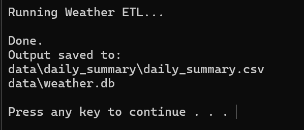
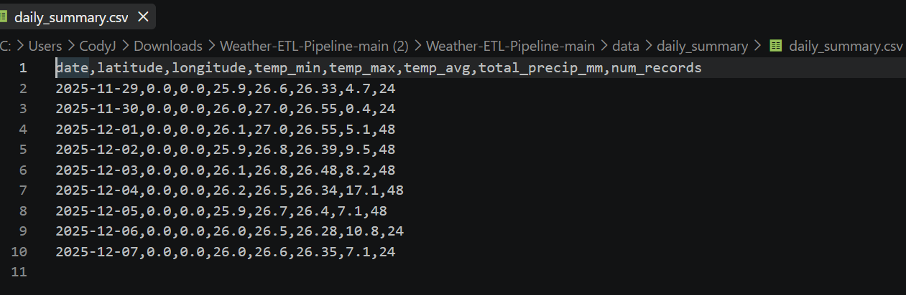

# Weather ETL Pipeline

A Python ETL pipeline that fetches weather data from Open-Meteo, transforms it into structured hourly records, stores it in SQLite, and generates daily summary CSVs.



## Pipeline

```text
Open-Meteo API
      ↓
   Extract
      ↓
  Transform
      ↓
SQLite + Daily CSV
      ↓
Optional LSO Telemetry
```

## Features

- Fetches live weather data from Open-Meteo
- Transforms hourly weather records
- Persists structured data to SQLite
- Generates daily temperature and precipitation summaries
- Configurable latitude and longitude
- Optional integration with Living Systems Observatory
- One-click Windows launcher

## Example Output



The daily summary includes date, location, minimum/maximum/average temperature, precipitation, and hourly record count.

## Run It

### Windows

1. Click **Code → Download ZIP**
2. Extract the ZIP
3. Open the folder
4. Double-click **`run.bat`**

The launcher installs any missing dependencies and runs the pipeline.

Output is saved to:

- `data/weather.db`
- `data/daily_summary/daily_summary.csv`

> Python must already be installed.

## Built With

- Python
- Pandas
- SQLite
- Requests
- Open-Meteo API

## Related Project

The pipeline can optionally send telemetry to my **Living Systems Observatory** backend for health and metrics monitoring.
